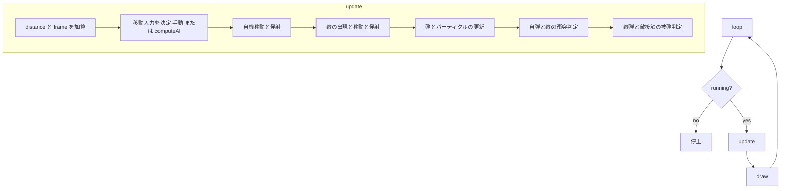

# 横スクロールシューティング 実装仕様

対象ファイル: `shooting-game.html`

単一の HTML ファイルで動作する。canvas 2D と requestAnimationFrame のみを使用し、外部ライブラリや画像アセットは持たない。すべての描画はベクター図形で行う。

## 画面構成

- canvas サイズは幅 900 高さ 540
- HUD は左上に距離・スコア・残機・モード状態を 1 行で表示する
- overlay はタイトルとゲームオーバーの両方を兼ねる。テーマ選択・難易度選択・オートプレイ切替・開始ボタンを内包する
- プレイフィールドは canvas 全域。自機の移動可能範囲は x が 20 から 540 まで、y が 20 から 520 まで

## 操作

| 操作 | キー |
| --- | --- |
| 移動 | 矢印キー または WASD |
| 発射 | スペース |
| テイスト切替 | T |
| オートプレイ切替 | O |

移動入力は方向ベクトルとして合成し、`player.speed` を掛けて位置に加算する。手動とオートプレイは同じ移動経路を通り、入力源だけが切り替わる。

## ゲーム状態

reset で初期化する主な変数を示す。

| 変数 | 初期値 | 意味 |
| --- | --- | --- |
| score | 0 | 撃破で加算する得点 |
| lives | 3 | 残機 |
| distance | 0 | 飛行距離。進行度と難易度の基準 |
| frame | 0 | 経過フレーム |
| spawnTimer | 0 | 次の敵出現までのカウンタ |

distance は update のたびに 0.8 ずつ増える。frame は 1 ずつ増える。

## 自機

| 項目 | 値 |
| --- | --- |
| 速度 | 5 |
| 表示サイズ | 幅 44 高さ 26 |
| 被弾の当たり判定 | 中心から横 9 縦 8 の矩形 |
| 発射 | スペース押下中、cooldown 8 フレームごとに上下 2 連射 |
| 弾速 | 横方向 11 |
| 被弾後の無敵 | 90 フレーム。この間は点滅する |

機体の見た目は大きいが当たり判定は中心の小さな点に限定する。これにより弾幕でも機体のかすめでは被弾しない。

## テイスト

テーマは `THEMES` オブジェクトに定義する。キーは wafu, peru, ukraine, indonesia, india の 5 種。各テーマは配色・文言・フォントと、背景・自機・敵・浮遊物の描画関数一式を持つ。

切替はタイトルのボタン、またはゲーム中の T キーで循環する。`applyTheme` が CSS 変数と overlay 文言を差し替える。

弾の描画だけはテイストに依存せず、一律でウクライナ仕様を使う。自弾は黄の麦穂、敵弾は青の弾になる。これは背景との同化を避けるための統一仕様である。敵弾は濃い縁取りと白いコアを重ねて、明るい背景でも暗い背景でも輪郭が出るようにする。

各テーマの題材を示す。

| テーマ | 背景 | 自機 | 敵 雑魚 | 敵 中型 | 敵 大型 | 浮遊物 |
| --- | --- | --- | --- | --- | --- | --- |
| wafu | 夕焼けと山並み | 和船 | 提灯お化け | 鬼火 | だるま | 桜 |
| peru | 青空とアンデス | コンドル | 土器の壺 | ハチドリ | 太陽仮面 | 紙吹雪 |
| ukraine | 青空と麦畑 | コウノトリ | 彩色卵 | ヒマワリ | 黄金の紋章 | ヒマワリの花びら |
| indonesia | 火山と緑の島 | ガルーダ | 影絵人形 | 極楽鳥 | バロンの仮面 | プルメリア |
| india | 夕焼けと宮殿 | クジャク | 灯明 | 蓮の花 | 法輪 | マリーゴールド |

## 敵

敵は kind で 3 種に分かれる。見た目はテーマごとに変わるが、挙動とパラメータは共通である。

| kind | 区分 | hp | 撃破点 | 移動 |
| --- | --- | --- | --- | --- |
| s | 雑魚 | 1 | 10 | 直進。上下に小さく揺れる |
| w | 中型 | 2 | 20 | 直進しながら正弦波で上下に蛇行 |
| b | 大型 | 6 | 50 | ゆっくり直進 |

敵は画面右外から出現し、左へ進む。x が -70 を下回ると消滅する。

## 弾の発射パターン

発射間隔と弾の撒き方は難易度で変わる。

### 通常モード

- 全種共通で自機を狙う単発弾を撃つ
- 弾速 3.6
- 発射間隔は大型 45 フレーム、それ以外 110 フレーム

### 鬼モード

弾幕だが、自機の当たり判定が小さく可動域が広いため、隙間を抜けて回避できる密度に調整している。

| kind | パターン | 弾数 | 弾速 | 発射間隔 |
| --- | --- | --- | --- | --- |
| s | 自機狙いの拡散 | 3 方向 角度間隔 0.32 | 2.6 | 78 フレーム |
| w | 全方位リング | 8 方向 | 2.1 | 96 フレーム |
| b | らせん扇 毎回 0.30 ずつ回転 | 5 方向 | 2.2 | 34 フレーム |

## スコアと進行度

- score は撃破で加算する。雑魚 10、中型 20、大型 50
- distance は飛行で自然に増える。撃破とは独立した進行度の指標
- HUD に距離とスコアの両方を常時表示する
- ゲームオーバー画面にスコアと到達距離の両方を表示する

## 難易度の漸増

distance を基準に、進むほど難しくなる。

進行度 lv は `min(1, distance / 4500)` で 0 から 1 へ変化する。

- 速度倍率は `1 + lv * 0.3` で最大 1.3 倍。敵の移動速度に掛かる
- 出現比率は進むほど雑魚が減り、中型と大型が増える。雑魚の確率上限は `0.70 - lv * 0.30`、中型までの累積確率は `0.92 - lv * 0.10`
- 同時出現数の上限は通常 9、鬼 6。distance が 3000 を超えると上限が 2 増える
- 出現間隔は distance が伸びるほど短くなる。通常は `max(26, 78 - distance * 0.018)`、鬼は `max(40, 95 - distance * 0.016)`

難易度は主に敵の量と構成で上げる。弾速は据え置きに近く、回避できる範囲を保つ。

## オートプレイ

弾を避ける挙動を観戦できるようにする自動操縦。`computeAI` が移動方向を返す。

採用しているのは軌道シミュレーション方式である。各脅威から離れるベクトルを単純合計する方式は、複数方向から弾が来ると力が打ち消し合って固まり、はさまれて被弾する。これを避けるため、移動先の安全性を直接評価する。

手順を示す。

1. 静止を含む 17 個の移動候補を用意する。静止 1 個と 16 方向
2. 各候補について、その方向に進んだ自機の未来位置を 3 フレーム刻みで 30 フレーム先まで求める
3. 同じ時刻の各弾の未来位置と比較し、距離 26 未満なら危険度を加算する。近い未来ほど重みを大きくする
4. 敵本体の未来位置とも比較し、距離 44 未満なら危険度を加算する
5. 移動先が場外なら危険度に 40 を加える
6. 危険度が最小の候補を選ぶ。同程度なら、一番手前の敵の高さに合わせて左寄りに陣取る方向と、動きの小さい方向を好む

オートプレイ中は常時発射する。

## ゲームループ

## 被弾と終了

- 敵弾の被弾判定は自機中心の横 9 縦 8 の矩形
- 敵本体との接触判定は自機と敵の各サイズの和の 3 分の 1 を各軸でしきい値とする
- 被弾すると残機が 1 減り、90 フレームの無敵に入る
- 残機が 0 になると endGame を呼び、overlay にスコアと到達距離を表示する

## コード構成

- `THEMES` テーマ定義の集合。配色・文言・描画関数を持つ
- `applyTheme` テーマ適用。CSS 変数と overlay 文言を切り替える
- `reset` ゲーム状態の初期化
- `spawnEnemy` 進行度に応じた敵の生成
- `shootEnemy` 難易度に応じた敵の発射
- `computeAI` オートプレイの移動方向決定
- `update` 1 フレームぶんの状態更新
- `draw` 1 フレームぶんの描画
- `loop` requestAnimationFrame による駆動
- `startGame` `endGame` 開始と終了の処理
